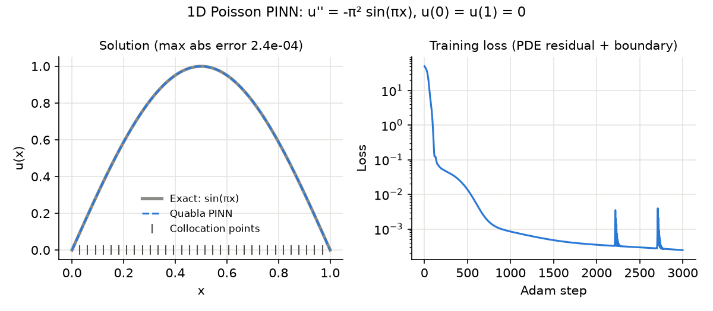

# Quabla

**Differentiable scientific computing for physics-informed neural networks
(PINNs): a Rust compiler and runtime with a JAX-style Python API that runs one
traced program on CPU, CUDA, and Apple silicon.**

[](https://github.com/latteine1217/quabla/actions/workflows/ci.yml)
[](#license)
[](#installation)
[](https://github.com/latteine1217/quabla/releases/tag/v0.4.0)



*A 16-unit tanh MLP trained as a PINN on the CPU backend (3,000 Adam steps)
matches the exact solution `sin(πx)` to a max abs error of 2.4e-4.
Reproduce with `python examples/plot_readme_figure.py`.*

## Why Quabla

- **One program, three backends.** Trace once, then compile for the `f64` CPU
  reference, CUDA (Linux), or MLX (Apple silicon); device backends are
  validated operation by operation against the CPU reference.
- **Exact higher-order derivatives.** JVP, VJP, Jacobians, Hessians, and
  Hessian-vector products compose with each other and with `vmap`, so a PINN
  residual uses an exact `u_xx` that is itself differentiable in the weights.
- **Differentiable control flow.** `cond`, `fori_loop`, and `scan` are IR
  regions, not traced Python branches, with VJP and forward-over-reverse HVP
  on CPU and MLX and, for elementwise loop bodies, on CUDA.
- **Explicit rather than silent.** Mixing `float32` and `float64` arrays
  requires an explicit `astype`, and an operation a backend does not support
  raises an error instead of falling back to the host.

## At a Glance

`grad(grad(u))` gives an exact `u_xx` at one point, `vmap` maps it over the
collocation points, and the PDE-residual loss built from it is compiled once
and trained with reverse-mode gradients and Adam:

```python
import math
import quabla as qb

def u(x, w):  # the model at one collocation point x
    return qb.sin(w * x)

u_xx = qb.vmap(qb.grad(qb.grad(u)), in_axes=(0, None))  # exact d2u/dx2 per point

def loss(params, x):  # residual of u'' = -pi^2 sin(pi x), solved by w = pi
    return qb.mean((u_xx(x, params["w"]) + math.pi**2 * qb.sin(math.pi * x)) ** 2)

x = qb.linspace(0.05, 0.95, 8)
params, adam = {"w": qb.array(2.5)}, qb.optim.Adam(learning_rate=0.05)
step = qb.jit(qb.value_and_grad(loss))  # traced and compiled on the first call
for _ in range(300):
    value, grads = step(params, x)
    params = adam.step(params, grads)
print(f"w = {params['w'].item():.6f}, loss = {value.item():.1e}")
```

```text
w = 3.141593, loss = 1.5e-13
```

The [Quickstart](#quickstart) covers arrays, dtypes, masks, `vmap`, and
running on CUDA or MLX.

## Status

The latest release is **v0.4.0**, a research-grade pre-release published as
a git tag and GitHub Release; the PyPI distributions are built by CI and not
yet uploaded. The v0.2 series introduced the JAX-style API
([CHANGELOG](CHANGELOG.md#020---2026-10-06), [design](docs/api_v0_2_design.md)):
`grad`, `value_and_grad`, `jvp`, `vjp`, `jacobian`, `hessian`, `vmap`, and
`jit(device="cpu" | "cuda:N" | "mlx")` over arrays and pytrees, `quabla.optim`
with a retained-buffer `Trainer`, `cond`/`fori_loop`/`scan`, and experimental
single-node CUDA/NCCL data parallelism. v0.3
([CHANGELOG](CHANGELOG.md#030---2026-10-06)) fills in what a PINN or
scientific-ML user expects from the JAX ecosystem: L-BFGS, AdamW and
learning-rate schedules; `quabla.linalg` (batched `solve`, `slogdet`, `eigh`,
`qr`, `svd`, `lstsq`); `quabla.ode.odeint` with fixed-step and adaptive
Dormand-Prince integration; `while_loop`; `custom_vjp`, `custom_jvp`, and
`checkpoint`; registered pytree nodes; keyed `quabla.random`; stable
`softmax`/`logsumexp`/`var`; NumPy-style shape helpers; `save`/`load`; and
opt-in native `float64` on CUDA. v0.4
([CHANGELOG](CHANGELOG.md#040---2026-10-06)) adds native trigonometric,
hyperbolic, logarithmic, and rounding functions and `fmod`/`mod`; the
jax.numpy shape, product, and calculus functions (`pad`, `roll`,
`tensordot`, `kron`, `diff`, `trapezoid`, `interp`, ...) with
`linalg.norm`/`matrix_power`/`pinv`; stiff integration
(`odeint(method="rosenbrock23")`) and `saveat`; `linalg.cg`, `linalg.gmres`,
and `newton` with implicit-function-theorem gradients; matrix
factorizations on MLX; AdamW, SGD, global-norm clipping, and CUDA `float64`
in the device `Trainer`; CUDA-graph replay of host-driven CUDA loops; and
native `max`/`min` reductions.

All v0.1 call forms keep working. Migrated top-level names emit a
`DeprecationWarning` once per name on explicit access (`from quabla import *`
binds them silently); the 2D API is available without warnings
in `quabla.legacy`, and `quabla.Adam` aliases `quabla.optim.Adam` while
preserving its stateful dictionary `step`.
The 0.x API may still change between releases through additions and
deprecations (see the [compatibility policy](CONTRIBUTING.md#scope-and-status)). The 2D `Matrix`,
`trace(...)`, and `TraceGraph` API is legacy, kept for compatibility without
new backend features.

"JAX-style" describes the API only: Quabla does not depend on JAX and is not
affiliated with JAX or with the `nabla-ml` project. It was formerly named
Nabla and was renamed to Quabla (after □, the d'Alembert operator) before
v0.1.

## Backend Support

`float64` programs execute as `f32` on MLX, and on CUDA unless
`jit(..., device="cuda", precision="float64")` selects native double
precision; `bool` values are held as `f32` `0`/`1` on both devices. Device
`jit` warns once for logical `float64` programs that run as `f32`. The v0.2 API inherits the backend limits below; it does not widen
the supported loop bodies or derivatives. The per-feature status and validation
records are in [docs/jax_like_roadmap.md](docs/jax_like_roadmap.md).

| Backend | Platform | Build feature | Execution dtype | Autodiff | Control flow | Notable limitations |
| --- | --- | --- | --- | --- | --- | --- |
| CPU | macOS, Linux | default | `f64` reference; each `float32` op is the `f64` result rounded to `f32` | Runtime and symbolic JVP/VJP, dense Jacobian and Hessian, HVP, `vmap` JVP/VJP/HVP | `cond`, `fori`, `scan` regions with JVP, VJP, and forward-over-reverse HVP | Interprets frozen plans (no machine-code JIT) |
| CUDA | Linux, NVIDIA driver | `cuda` | `f32`; `f64` with `precision="float64"` | Symbolic JVP/VJP plans, multi-output value-and-gradient, `vmap` JVP/VJP/HVP, device `Trainer` with SGD/Adam/AdamW and global-norm clipping | `cond` via one host predicate readback; `fori`/`scan` as fused kernels for pure-elementwise bodies and as host-driven region loops otherwise; `while_loop` with one predicate readback per iteration | Host-driven loops cost one CUDA graph launch per iteration (eager launches for bodies with `cond`, nested loops, or cuSOLVER); requires `libnvrtc` at runtime (cuBLAS optional, cuSOLVER for `solve` and the decompositions) |
| CUDA + NCCL | Linux, two or more GPUs on one node | `cuda-nccl` | `f32` | Scalar value-and-gradient with all-reduced replicated parameter gradients | As CUDA | Single node; equal axis-zero batch shards; mapped-input gradients rejected; optimizer update on the host; requires a loadable `libnccl.so` |
| MLX | macOS, Apple silicon | `mlx` | `f32` | Symbolic JVP/VJP, multi-output value-and-gradient, `vmap` JVP/VJP, device `Trainer` with SGD/Adam/AdamW and global-norm clipping | `cond` via one host predicate readback; `fori`/`scan` dispatched from the host on device-resident arrays, with first-order VJP and forward-over-reverse HVP | LU, `eigh`, QR, and SVD factorizations run with LAPACK on MLX's CPU stream (MLX 0.32.2 has no GPU kernels for them), and `solve` reads one pivot flag back; `vmap` HVP not lowered; no fused Metal loop kernels |

Staged Cholesky uses a native operation on CPU, CUDA, and Metal. `float32`
and `float64` JVP, VJP, and second derivatives use bounded IR and O(n²)
numerical workspace with O(n³) arithmetic, and the CPU rounds every `float32`
jet operation to `f32`; `vmap`, Jacobian, and Hessian composition preserve
their existing call forms. Third or higher derivatives retain scalar
expansion to preserve rounding and composition. Non-finite and extreme-scale CPU symbolic derivatives retain the reference path.
Eager Cholesky keeps its strict symmetric positive-definite validation;
staged Cholesky keeps its lower-triangle recurrence and existing exceptional
value behavior. CUDA axis sums and means use a block reduction for axes of
length at least 256, with bounded shared memory and no global scratch buffer.
GPU results are checked with absolute and relative tolerances of `1e-5`;
finite CPU derivative results use `1e-12`.

## Installation

```sh
pip install quabla       # Linux x86_64: CPU + CUDA; macOS arm64: CPU
pip install quabla-mlx   # macOS 14+ on Apple silicon: CPU + MLX
```

Both distributions provide the same `quabla` package, so install one of them
per environment and uninstall it before switching to the other. Wheels cover
CPython 3.10 to 3.14; on other platforms pip builds the source distribution,
which needs a Rust toolchain and enables the CPU backend only.

The Linux wheel does not bundle CUDA. The CPU backend works on any host, and
`device="cuda"` needs an NVIDIA driver and the CUDA libraries listed under
CUDA builds below; without them it raises an error naming the missing
library.

## Installation From Source

Prerequisites:

- Rust stable toolchain (`rustup`).
- Python 3.10 or newer and maturin 1.x (1.9.3 or later).
- MLX builds: macOS on Apple silicon, CMake, and Xcode's Metal Toolchain
  (`xcodebuild -downloadComponent MetalToolchain`). The Python `mlx` wheel is
  not used. The build writes the compiled Metal library to
  `~/.mlx/lib/<key>/mlx.metallib`, or to `$MLX_RS_METAL_PATH` when that
  variable is set at build time. At run time MLX first looks for an
  `mlx.metallib` next to the extension module and then at that build path,
  so keep it in place (or rebuild after removing it).
- CUDA builds: Linux with an NVIDIA driver. CUDA libraries are loaded at run
  time: `libnvrtc.so` is required, `libcublas` is used for rank-two `f32`
  GEMM when present (otherwise an NVRTC tiled kernel), and `libcusolver` is
  required for `solve`. Put their directory on `LD_LIBRARY_PATH`. The loaded
  `libnvrtc` must not be newer than the CUDA version the driver supports;
  otherwise loading generated kernels fails with
  `CUDA_ERROR_UNSUPPORTED_PTX_VERSION`. The two-GPU validation used CUDA 12.6.
- CUDA + NCCL builds: additionally NCCL loadable as `libnccl.so` (for example
  through `LD_LIBRARY_PATH`) and at least two CUDA devices. Ordinary `cuda`
  builds neither link nor load NCCL.

Create a virtual environment and build the extension in place:

```sh
git clone https://github.com/latteine1217/quabla.git
cd quabla
python3 -m venv .venv
source .venv/bin/activate
python -m pip install "maturin>=1.9.3,<2"

# Pick one:
maturin develop --release                        # CPU only
maturin develop --release --features mlx         # macOS, Apple silicon
maturin develop --release --features cuda        # Linux, CUDA
maturin develop --release --features cuda-nccl   # Linux, CUDA + NCCL

python -c "import quabla; print(quabla.__version__, quabla.Compiler().capabilities())"
```

### Building Wheels

`maturin build --release` writes a wheel for the active interpreter to
`target/wheels/` (`--out DIR` changes the directory); pass the same
`--features` as for `maturin develop`. A wheel contains the `quabla`
package, the compiled extension, its type stub `_quabla.pyi`, and `py.typed`.
For an MLX wheel that works on other machines, ship the Metal library next
to the extension, where MLX looks first:

```sh
export MLX_RS_METAL_PATH="$PWD/target/mlx-metal"
cargo build --release -p quabla-core --features mlx   # writes mlx.metallib
cp "$MLX_RS_METAL_PATH/mlx.metallib" python/quabla/
MACOSX_DEPLOYMENT_TARGET=14.0 maturin build --release --features mlx
```

The `Wheels` workflow ([.github/workflows/wheels.yml](.github/workflows/wheels.yml))
builds the published distributions for CPython 3.10 to 3.14: `quabla` wheels
for Linux x86_64 (manylinux_2_28, `cuda-nccl` features) and macOS arm64 (CPU),
the `quabla` source distribution, and `quabla-mlx` wheels for macOS arm64
(`mlx` feature). Version tags publish them to TestPyPI and then PyPI through
trusted publishing, each upload after approval; a manual run builds them and
can publish to TestPyPI only.

## Quickstart

The snippets below run in sequence in one session. Arrays come from Python
lists, scalars, or NumPy arrays (NumPy is optional), with dtype `float32`,
`float64`, or `bool`. Host arrays use immutable shared buffers with 4 bytes per
`float32` element, 8 per `float64` element, and 1 per `bool` element, excluding
metadata. Shape-only views share storage, and matching-dtype buffer exports
are read-only and zero-copy. CPU/MLX Fori and Scan gradients use block
checkpoints to reduce carry-tape storage from O(TC) to O(sqrt(T)C), with a
measured replay cost. CUDA uses this path for independent lanes and same-shape
captures; other captures keep the full tape. Public Scan outputs remain O(TY).
Reproducible optimization results and limitations are recorded in the
[roadmap](docs/jax_like_roadmap.md#integrated-optimization-status-2026-10-05).

`grad` and `value_and_grad` differentiate with respect to the first argument
(or `argnums`), and gradients mirror its pytree, here a dict of `float32`
parameters:

```python
import numpy as np
import quabla as qb

x = qb.array([-1.0, 0.5, 1.0, 2.0], dtype=qb.float32)  # from a list
w = qb.asarray(np.array([0.3, -0.2, 0.1, 0.4], dtype=np.float32))  # dtype from NumPy
mask = x > 0.0  # comparisons return bool masks
print(x.dtype, w.dtype, mask.dtype, mask.tolist())
print(qb.sin(x).numpy())

def loss(params, x):
    y = qb.tanh(x * params["w"] + params["b"])
    return qb.sum(qb.where(x > 0.0, y, 0.0) ** 2)  # masked entries contribute 0

params = {"w": w, "b": qb.array(0.2, dtype=qb.float32)}
value, grads = qb.value_and_grad(loss)(params, x)  # gradients mirror the dict
print(value.dtype, value.item())
print(grads["w"].tolist(), grads["b"].item())
print(qb.grad(loss, argnums=1)(params, x).tolist())  # d loss / d x
```

```text
f32 f32 bool [False, True, True, True]
[-0.84147096  0.47942555  0.84147096  0.9092974 ]
f32 0.6748224496841431
[-0.0, 0.09867792576551437, 0.53318190574646, 1.2793999910354614] 1.3702377080917358
[0.0, -0.03947117179632187, 0.053318191319704056, 0.2558799982070923]
```

The masked coordinate has a zero gradient: `where` routes no derivative
through the unselected branch or its predicate. `vmap` vectorizes a function
written for one example, and `jit` compiles once per argument signature
(shapes, dtypes, pytree structure) and reuses the frozen plan:

```python
xs = qb.array([[0.5, 1.0, 2.0, -1.0], [1.0, 1.0, 1.0, 1.0]], dtype=qb.float32)
per_example = qb.vmap(loss, in_axes=(None, 0))  # params shared, rows of xs mapped
print(per_example(params, xs).tolist())

step = qb.jit(qb.value_and_grad(loss))  # traced and compiled on the first call
value, grads = step(params, x)  # later calls with the same shapes reuse the plan
print(value.item(), grads["b"].item())
```

```text
[0.2575097382068634, 0.5868375897407532]
0.6748224496841431 1.3702377080917358
```

To run this transformed step on a device, use
`qb.jit(qb.value_and_grad(loss), device="cuda:0")` or `device="mlx"`.
`qb.devices()` reports built targets, rather than enumerating hardware.
The compiler facade remains available for named input specs:

```python
compiler = qb.Compiler()
print(compiler.capabilities())
specs = [("x", [4], qb.float32), ("w", [4], qb.float32), ("b", [], qb.float32)]
program = compiler.trace(lambda x, w, b: loss({"w": w, "b": b}, x), specs)
grad_w = program.vjp("loss_bar")["w"]  # symbolic reverse mode, also a Program
inputs = {"x": x, **params}
seed = {"loss_bar": qb.array(1.0, dtype=qb.float32)}  # d loss / d loss
for target in ("cpu", "mlx", "cuda"):
    if compiler.capability(target):
        value = program.compile(target)(inputs).item()
        print(target, value, grad_w.compile(target)({**inputs, **seed}).tolist())
```

Output of an MLX build on Apple silicon (a CUDA build prints a `cuda` line
instead of the `mlx` line). The device executes in `f32` and agrees with the
CPU `float32` reference up to rounding:

```text
{'cpu': True, 'cuda': False, 'mlx': True}
cpu 0.6748224496841431 [-0.0, 0.09867792576551437, 0.53318190574646, 1.2793999910354614]
mlx 0.6748223900794983 [-0.0, 0.09867792576551437, 0.53318190574646, 1.279400110244751]
```

For device training, `tensor_value_and_grad_{mlx,cuda}_fn` compute a loss
and its gradients in one device plan, and `mlx_adam_loss_optimizer` and
`cuda_adam_vjp_optimizer` keep parameters and Adam moments on the device; see
[docs/api.md](docs/api.md#device-execution) and the PINN examples in
[examples/README.md](examples/README.md), which use the v0.1 helpers.

## Known Limitations

- The CPU backend interprets frozen plans; there is no machine-code JIT.
- Shapes are static (bounded per-batch-size specialization, no symbolic
  dimensions), and dtypes are limited to `float32`, `float64`, and `bool`.
- Indexing takes static Python integers; dynamic index tensors and
  boolean-mask indexing are unsupported.
- CUDA runs loop bodies that are not purely elementwise as host-driven loops,
  one CUDA graph launch per iteration (about 30 µs for a small `fori_loop`
  body on a GTX 1660 SUPER). MLX factors matrices on its CPU stream and has
  no `vmap` HVP lowering. Third and higher Cholesky
  derivatives use a scalar expansion that is slow beyond small matrices.
- Data parallelism is single-node CUDA + NCCL only.
- `quabla.vmap` cannot batch `cond`/`fori`/`scan`/`while` regions over a
  mapped argument; `while_loop` has no reverse-mode derivative, as in JAX. `jacobian` selects reverse mode for fewer floating output than
  input elements, and forward mode otherwise; direction changes can affect
  final rounding. Mixed precision graphs with F64 output blocks keep forward
  mode. `jacobian`/`hessian` still return dense arrays.

The full list is in [docs/api.md](docs/api.md#known-limitations).

## Documentation

- [docs/api.md](docs/api.md): function transforms, device execution, the
  compiler facade, the v0.1 API reference, and the full list of known
  limitations.
- [docs/api_v0_2_design.md](docs/api_v0_2_design.md): the accepted v0.2 API
  design and its implementation status.
- [examples/README.md](examples/README.md): PINN examples and benchmarks.
- [docs/jax_like_roadmap.md](docs/jax_like_roadmap.md): roadmap, per-phase
  status (P0-P7, dtype phases D1-D6), validation records, and open items.
- [docs/design.md](docs/design.md): original core design notes.
- [CHANGELOG.md](CHANGELOG.md): release notes.
- [CONTRIBUTING.md](CONTRIBUTING.md): how to propose changes and which
  [development gates](CONTRIBUTING.md#development-gates) to run.
- [SECURITY.md](SECURITY.md): how to report a vulnerability.
- [CITATION.cff](CITATION.cff): citation metadata for academic use.

## License

Quabla is licensed under either of [Apache License, Version 2.0](LICENSE-APACHE)
or [MIT license](LICENSE-MIT), at your option.
